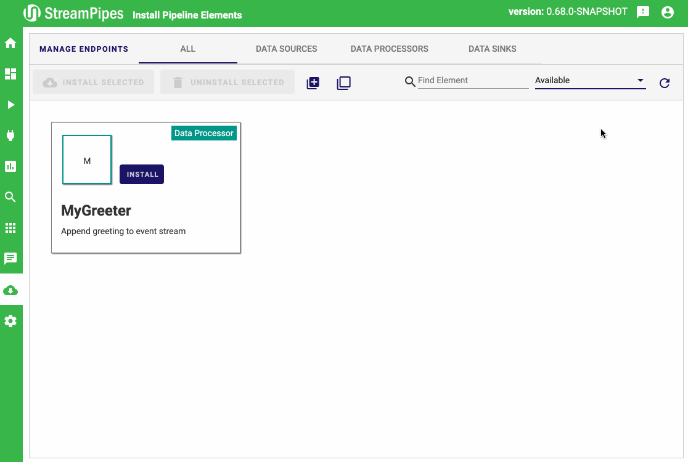

<!--
  ~ Licensed to the Apache Software Foundation (ASF) under one or more
  ~ contributor license agreements.  See the NOTICE file distributed with
  ~ this work for additional information regarding copyright ownership.
  ~ The ASF licenses this file to You under the Apache License, Version 2.0
  ~ (the "License"); you may not use this file except in compliance with
  ~ the License.  You may obtain a copy of the License at
  ~
  ~    http://www.apache.org/licenses/LICENSE-2.0
  ~
  ~ Unless required by applicable law or agreed to in writing, software
  ~ distributed under the License is distributed on an "AS IS" BASIS,
  ~ WITHOUT WARRANTIES OR CONDITIONS OF ANY KIND, either express or implied.
  ~ See the License for the specific language governing permissions and
  ~ limitations under the License.
  ~
  -->
  
## Apache StreamPipes Demo @ApacheCon
How to write your own StreamPipes data processor? Simple `greeter` data processor appending a user-defined text to an input event stream.

**Links**:
* GitHub: [https://github.com/apache/incubator-streampipes](https://github.com/apache/incubator-streampipes)
* Website: [https://streampipes.apache.org/](https://streampipes.apache.org/)

**Optimized for StreamPipes Version: 0.69.0-SNAPSHOT**



## Prerequisite
* Java 8 JDK (minimum)
* Maven (tested with 3.6)
* Docker >= 17.06.0
* Docker-Compose >= 1.17.0 (Compose file format: 3.4)
* Google Chrome (recommended)
* IntelliJ (reccommended)
* For Windows Developer: GitBash only

## Usage
#### Step 1: Clone repository
```bash
git clone https://github.com/wipatrick/apachecon-demo-processor
```

#### Step 2: Setup StreamPipes environment with **[StreamPipes CLI](https://github.com/apache/incubator-streampipes-installer)**
> **Hint**: read StreamPipes CLI `README` for more details on various options.
```bash
git clone https://github.com/apache/incubator-streampipes-installer
cd cli/
./streampipes env --set pipeline-element
./streampipes up -d
```
Go to [http://localhost](http://localhost) to finish the installation in the browser.

#### Step 3: Import maven project
Open this repo as a project in IntelliJ (recommended).

#### Step 4: Start "MyGreeterProcessor" run configuration
If you use IntelliJ you're ready to go. Just use our run config `MyGreeterProcessor` (see `.idea/runConfiguration`) which
should be auto-loaded when importing the Maven project and run the application.

[comment]: <> (Since we're running the processor natively on your system, and the rest of StreamPipes inside Docker containers. We need)

[comment]: <> (to make sure that both ends are able to communicate with each other. Thus, we use the environment variables `SP_HOST`,)

[comment]: <> (`SP_PORT` and `SP_DEBUG` to configure the data processor what host and port it is running on and that we're in dev/debug)

[comment]: <> (mode.)

[comment]: <> (**Settings**: )

[comment]: <> (* **Windows, Mac** user: `SP_HOST=host.docker.internal` is already set.)

[comment]: <> (* **Linux** user: set `SP_HOST` to your `docker0` bridge IP &#40;see `ifconfig`&#41;.)

> **Note**: if you're not using IntelliJ and want to run the demo you can so by starting the processor from the command line
> `mvn spring-boot:run`. The environment variables such as `SP_HOST` can be set in the `pom.xml`.

#### Step 5: Install Pipeline Elements in StreamPipes UI
Go to the StreamPipes UI and navigate to the 'Install Pipeline Elements' view. You can either search for the newly started
`MyGreeter` data processor or filter for 'Available' (right hand side). Click 'Install' to install the data processor.
When done, you can navigate to the 'Pipeline Editor' and see the added `MyGreeter` data processor in the Data Processors
tab.

#### Step 6: Build & start pipeline
You can any data stream since `MyGreeter` does not pose any input event stream requirements. So, just build a basic
pipeline to get started, e.g. by using our pre-shipped `Flowrate` data stream, connect it to `MyGreeter` and specify
your greeting message that is to be appended, and hook it up with a data sink, e.g. our internal `Dashboard` sink.

**Pipeline**: Flowrate -> MyGreeter -> Dashboard

Set a pipeline name and start it.

#### Step 7: Create dashboard
Navigate to the 'Dashboard' view, create and new dashboard and click edit. After you can add a visualization for the
running pipeline you just started, e.g. table visualization. You should now see the input event stream with your appended
greeting message :tada: :tada: :tada:

#### Step 8: Clean up
When done, stop the pipeline, stop the run configuration in IntelliJ and shutdown StreamPipes including deleting all
generated named docker volumes.
```bash
./streampipes down --volumes
```

## What's next? Where to go from here?
1. Start the application in debug mode and set a breakpoint in the `onEvent()` method inside `MyGreeter` class to start
debugging your data processor.
2. Modify the `declareModel()` method inside the `MyGreeterProcessor` class. Check static properties in the 
[StreamPipes Docs](https://streampipes.apache.org/docs/docs/dev-guide-static-properties/) and 
[StreamPipes examples](https://github.com/apache/incubator-streampipes-examples) for more options.
> **IMPORTANT**: When making changes to the `declareModel()` you have to reload this description from the UI. Thus, stop and remove
running pipelines containing this processor. Navigate to 'Install Pipeline Elements', chose `MyGreeter` and click on the
`...` button to reload the model. 
2. Package the data processor as a Docker image (see `Dockerfile`).

## Get help
If you have any problems during the installation or questions around StreamPipes, you'll get help through one of our 
community channels:

- [Mailing Lists](https://streampipes.apache.org/mailinglists.html)

And don't forget to follow us on [Twitter](https://twitter.com/streampipes)!